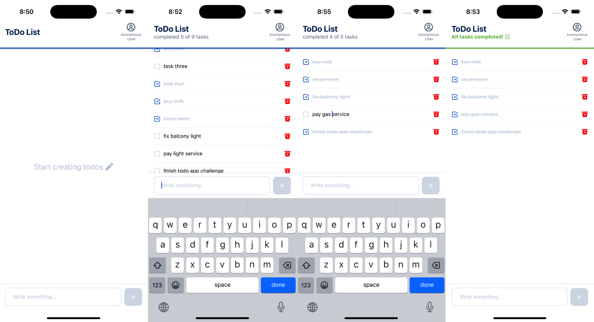

<p align="center">
  
</p>

# Todo app challenge

1. Functionality:

   - Users can create, edit, mark as completed, and delete to-do items
   - Users can mark to-do items as complete
   - The app should display a list of all to-do items

2. Technical Specifications:
   - Frontend: React Native with TypeScript
   - Backend: Node.js with a backend framework of your choice
   - Database: Choose a database suitable for your backend framework
   - Authentication: Implement simple session-based authentication. No need for detailed user profiles (name, last name, email are not required)
   - Concurrency: The app should support multiple users concurrently
   - Cross-Platform Compatibility: The app must compile and run on Android, iOS, and web

## Pre-requisites

- Docker and docker compose ([download](https://www.docker.com/))
- Free ports:
  - 8080 (Backend API)
  - 8081 (Frontend web)
  - 3307 (MySQL)
  - 19006 (Expo server)

## Run Web Version (Docker)

```bash
# Start app
docker compose up -d

# Access at http://localhost:8081
# Note: on rare occasions app hangs on first launch with docker; just refresh the browser and app will work normally

# Stop app
docker compose down -v
```

## Run Mobile Version

Follow instructions in [mobile README](client/todo-app/README.md)

## Run backend tests with Docker (front end tests coming soon!)

```bash
docker-compose run backend-test
```

## Features

- create tasks items using the input at the bottom and the + button to submit
- edit tasks titles by simply clicking/tapping on the task item and typing. When tapping somewhere else app will save the changes
- mark a task as cmopleted by clicking/tapping the checkbox
- delete a task by clicking/tapping the trash bin icon

## Technical Stack

### Frontend

- React Native with TypeScript
- Expo for cross-platform development
- AsyncStorage for local data persistence

### Backend

- Node.js with Express
- MySQL database
- UUID for session management

## Detailed Documentation

- [Mobile Client Documentation](client/todo-app/README.md)
- [Backend Documentation](server/README.md)
