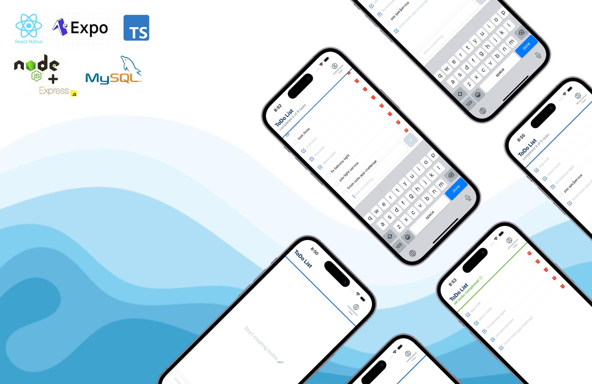

<p align="center">
  
</p>

# Todo app challenge (mobile client)

- more details in main [README.md](../../README.md)

## Pre-requisites

- Node.js v18+
- Android: Studio and an emulator available for use
- iOS: XCode and a simulator available for use
- Backend up and running (follow backend [README.md](/server/README.md) instructions)

## Quick Start

```bash
# Install dependencies
npm install

# Start development server
npx expo start

# Follow the expo terminal instructions:
# - Press 'a' to open Android emulator
# - Press 'i' to open iOS simulator
# - Press 'w' to open browser
```

## Features

- Create tasks with the bottom input field and '+' button
- Edit task titles by tapping on them (changes save on blur)
- Mark tasks as completed via checkbox
- Delete tasks using the trash bin icon
- Persistent storage with AsyncStorage for session management

## Technical Decisions

- **Expo**: Simplified development and build process
- **AsyncStorage**: Persistent local storage for session data
- **ESLint & Prettier**: Code formatting and standards
- **Expo Dev Client**: Fast development iteration

## Technology Stack

- React Native + Expo
- TypeScript
- AsyncStorage

## Improvement areas

- Unit and E2E testing to be able to test the app without the UI. Using jest and Detox.
